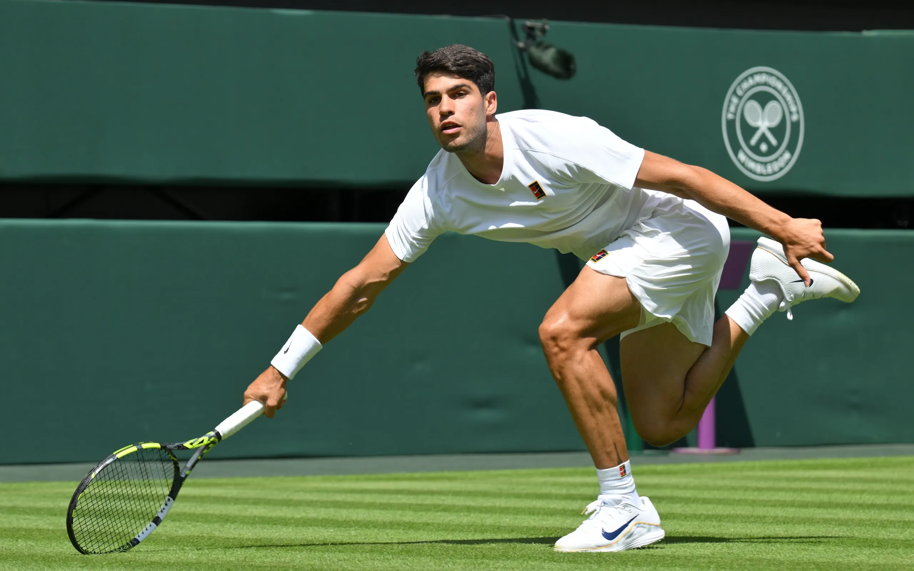

[← Volver al inicio](README.md)

# Temas del curso

### 16/09 · Mis aficiones

Llevo jugando al tenis desde los 9 años. Al principio,
empecé a entrenar solo porque mis amigos iban, pero 
luego me empezó a gustar. Entreno viernes y sábados por 
la mañana y algún día voy con mis amigos a jugar.
También llevo desde pequeña en una academia aprendiendo
inglés, el año pasado me saqué el B2.

Buscando en GitHub he encontrado [English](https://github.com/first20hours/google-10000-english),
una página donde puedes aprender hasta 10000 palabras.

---
### 28/09 · Premios Princesa de Asturias: Leo Messi

TU TEXTO DE 50 A 100 PALABRAS. En mitad del texto va el enlace, así:
[https://www.fpa.es/es/area-de-comunicacion-y-prensa/notas-de-prensa/leo-messi-premio-princesa-de-asturias-de-los-deportes-2026/]

Imagen: AUTOR, [Wikimedia Commons](https://commons.wikimedia.org/...)

---
