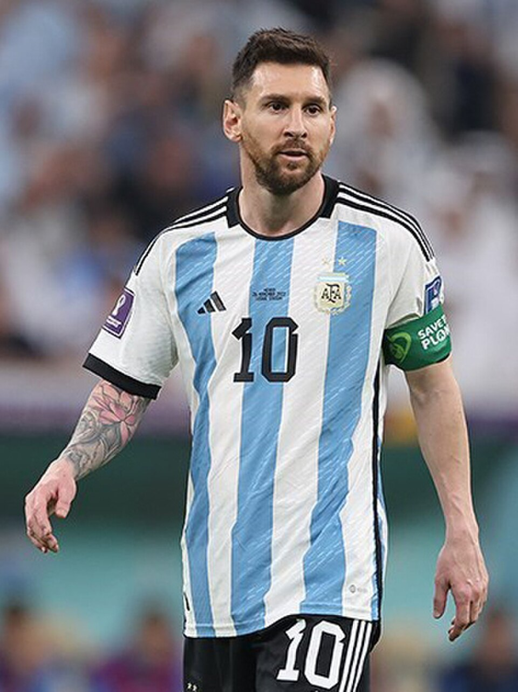

[← Volver al inicio](README.md)

# Temas del curso

### 16/09 · Mis aficiones

Llevo jugando al tenis desde los 9 años. Al principio,
empecé a entrenar solo porque mis amigos iban, pero 
luego me empezó a gustar. Entreno viernes y sábados por 
la mañana y algún día voy con mis amigos a jugar.
También llevo desde pequeña en una academia aprendiendo
inglés, el año pasado me saqué el B2.

Buscando en GitHub he encontrado [English](https://github.com/first20hours/google-10000-english),
una página donde puedes aprender hasta 10000 palabras.

---
### 28/09 · Premios Princesa de Asturias: Leo Messi

Leo Messi es un jugador profesional de fútbol que juega actualmente en el Inter de Miami y en total tiene 47 títulos, contando los de la selección Argentina de la que era el capitán, los de los equipos en los que jugó como el Barsa y los que ganó a nivel individual. Este ha sido galardonado con el Premio Princesa de Asturias de los Deportes de 2026, debido a su gran desarrollo en el deporte, haciendo que esto sea un ejemplo, para las personas, de los beneficios que otorga el deporte. [Su página en la Fundación.](https://www.fpa.es/es/area-de-comunicacion-y-prensa/notas-de-prensa/leo-messi-premio-princesa-de-asturias-de-los-deportes-2026/) Lo he elegido porque me gusta el fútbol, y a pesar de que haya jugado en el Barsa ya que yo soy del Real Madrid, me parece un gran jugador y una gran motivación para todas personas para que hagan deporte ya que otorga grandes beneficios para la salud.

Imagen: Hossein Zohrevand, [Wikimedia Commons](https://commons.wikimedia.org/wiki/File:Lionel-Messi-Argentina-2022-FIFA-World-Cup_(cropped).jpg)

---
